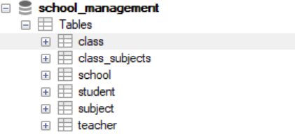

# School Management REST API

A RESTful application built with Spring Boot, Spring Data JPA, and Maven,designed to manage Schools, Students, Teachers, Classes, and Subjects.

All core requirements are complete  
All endpoints are in working condition  
Bonus: Swagger/OpenAPI documentation added  
Docker setup written but needs MySQL port fix (will resolve soon)

---

## Database Tables Preview

👉 _See image below for table structures and relationships (Click to zoom)_  

--

